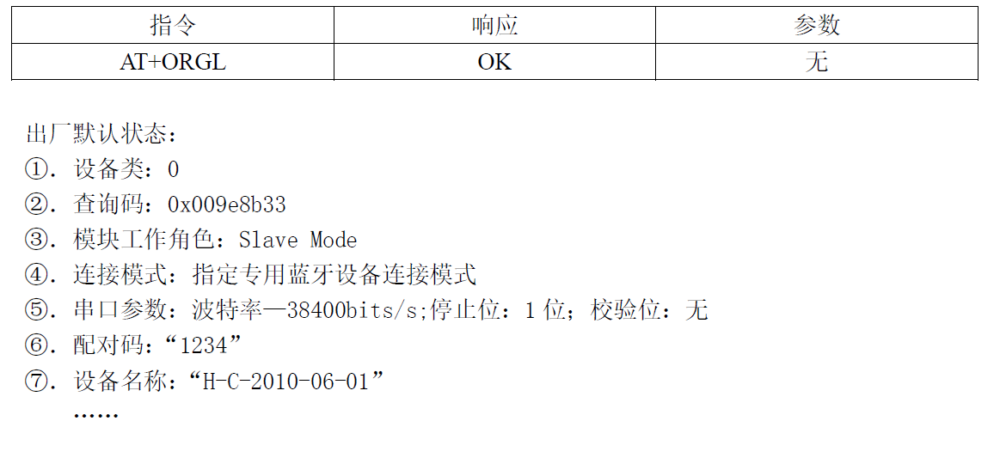
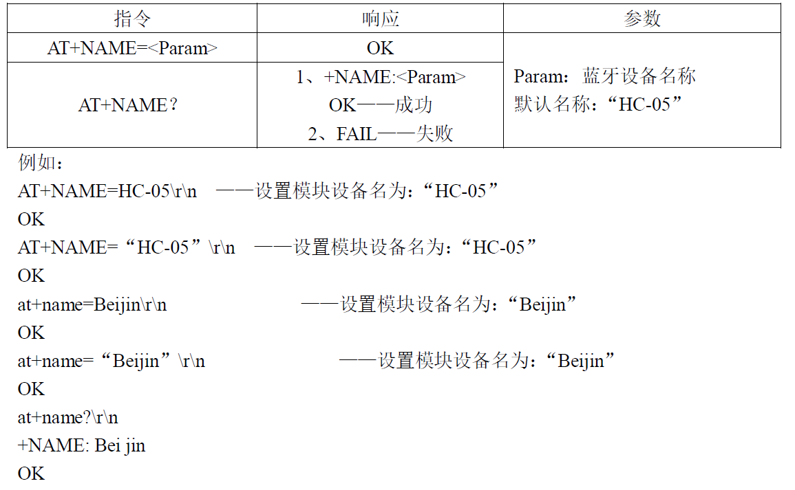
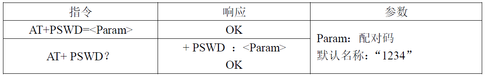
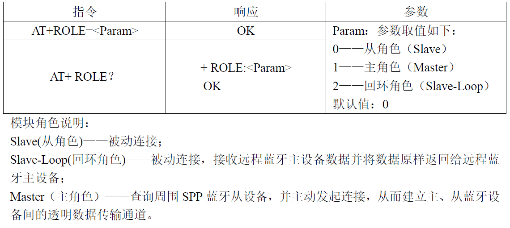
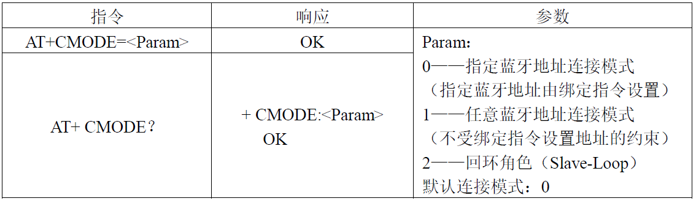
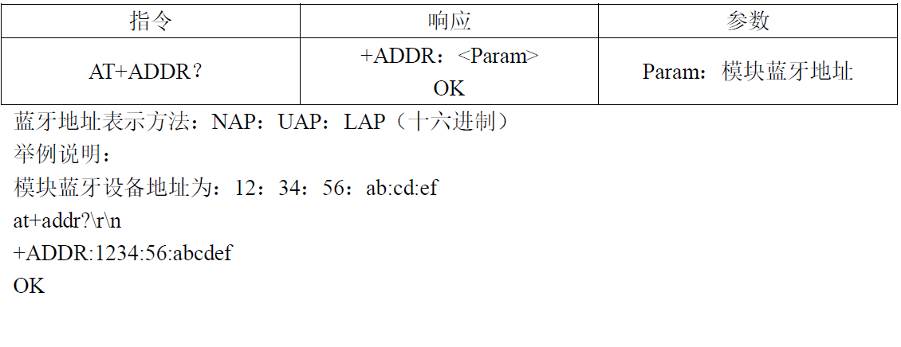
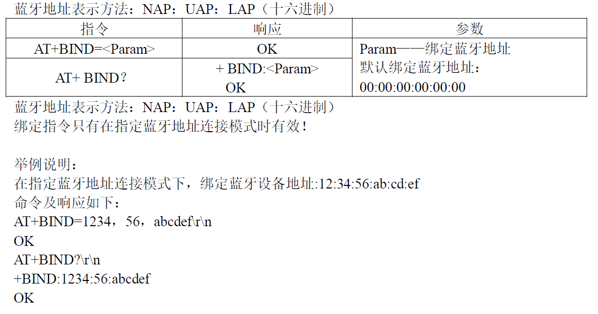
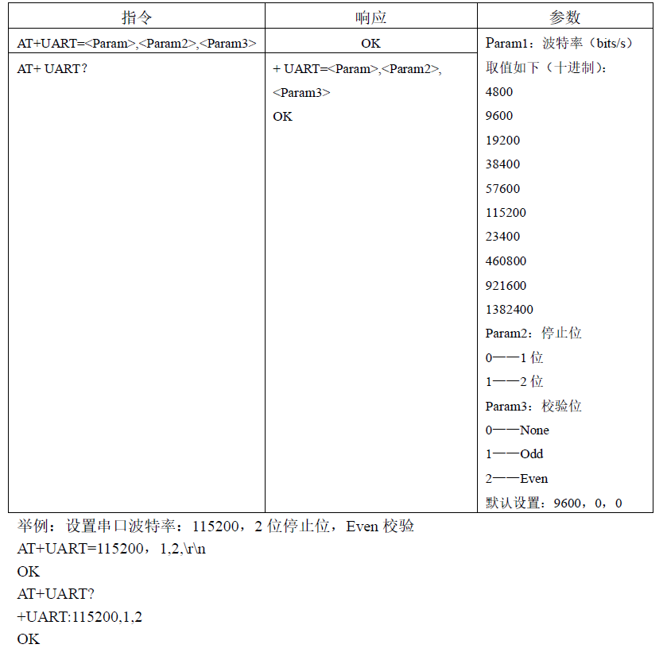

# 蓝牙配对教程

## step 1

- **蓝牙连接进入at设置模式（命令响应工作模式）。**

  两个蓝牙分别和usb转ttl连接，5v和gnd对应连接，rx接tx，tx接rx。按住蓝牙模块上的复位键，上电(即连上线)。此时指示灯应当慢闪，进入at调试模式。
  打开串口调试助手，设置对应端口，波特率为38400(at模式一定是38400)，其余按照默认设定。

## step 2

- **at指令设置**

> AT指令不区分大小写，均以回车、换行字符结尾：\r\n，要注意串口调试助手是否勾选发送新行，即/r/n

*具体步骤：主从机均执行：1,2,3,4,5,6,9；从机7，主机8*

1. **测试指令**

    指令     | 响应    | 参数    |
    :----:  |:----:  |:----:  |
    AT      |OK      |无       |

2. **恢复出厂设置**

    

3. **设置设备名称**

    

4. **设置配对码**

    

    at+pswd=。。。\r\n
    设置密码，主从机一定要相同，不同机建议不同。

5. **设置主从模式**

    

    设置主从模式，一个是0从机，一个是1主机。

6. **设置连接模式**

    

    因为要指定地址配对，所以选择1。

7. **获取模块蓝牙地址**

    

    此处需要获取从机的蓝牙地址，便于主机进行绑定，得到的地址中间是冒号：

8. **绑定地址**

    

    绑定地址(主机设置)，地址中间改成逗号。

9. **设置波特率**

    

    设置波特率，这个波特率是和单片机通讯的，以及使用时和pc机的波特率(两个要相同)，at模式的波特率依然是38400。

## 可能遇到的问题

> 错误代码返回形式——ERROR:（error_code）
> 具体的错误代码返回含义可参考本文件夹中：HC05指令集第12页。

  at+init\r\n 启动spp。用于解决error16,17